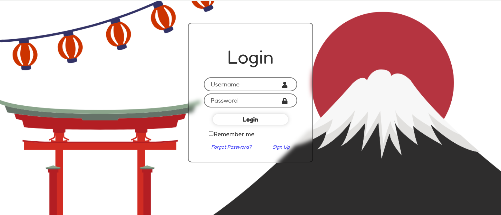
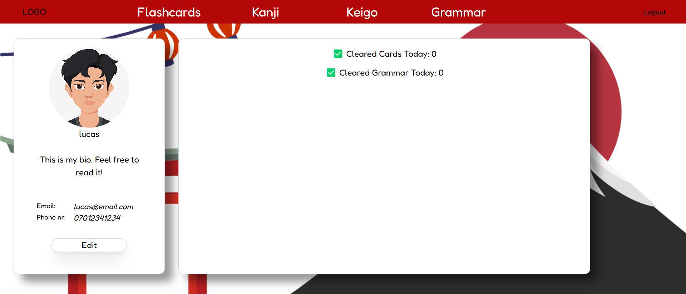
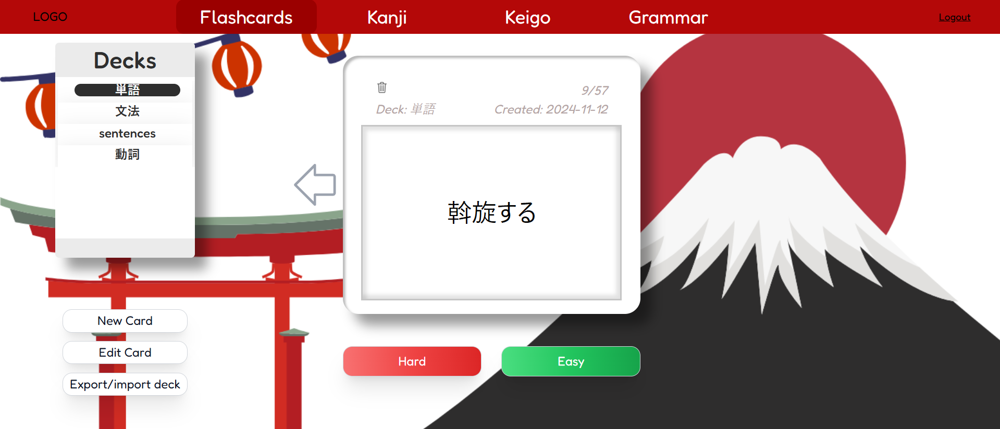
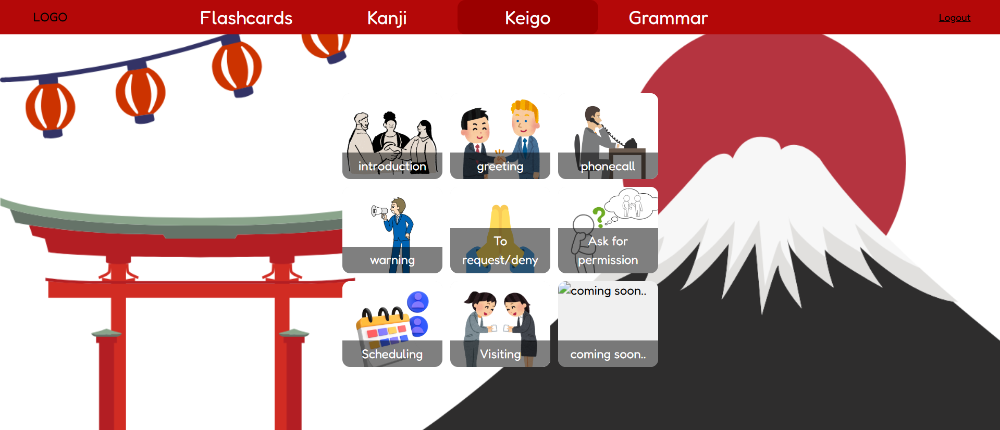
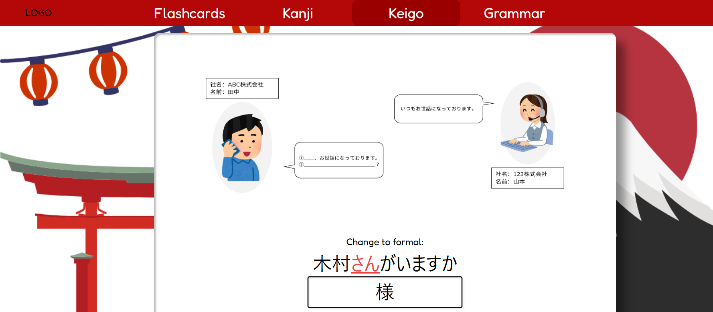
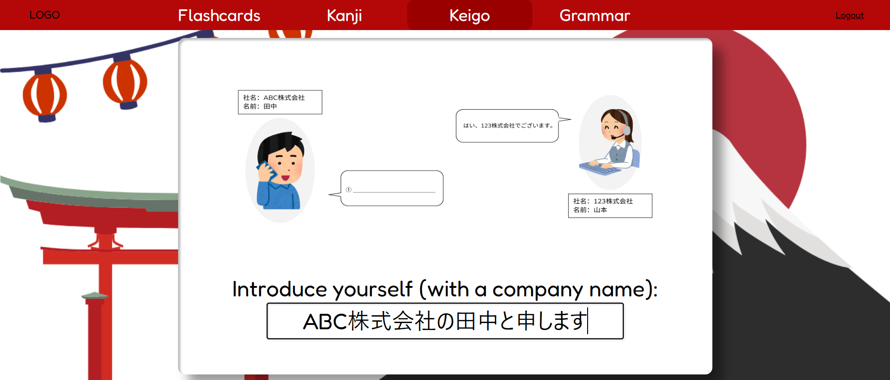
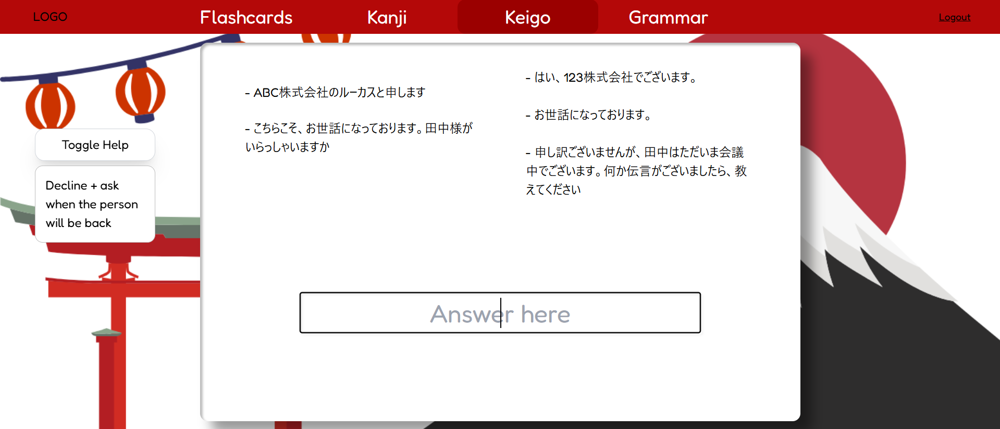
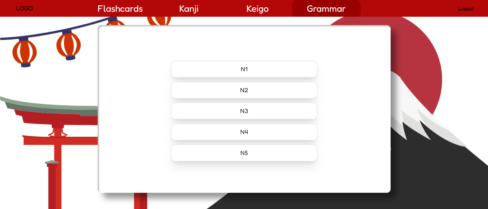
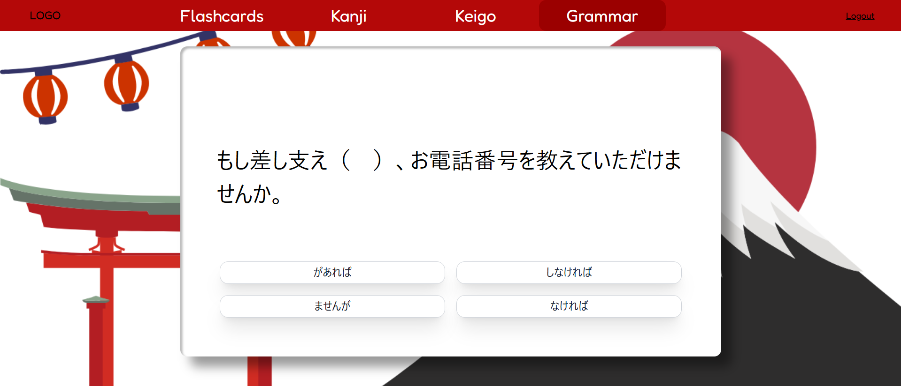

## プロジェクトの概要
このウェブアプリは、日本語を楽しく学ぶためのツールです。
JLPTレベルごとの文法やビジネス日本語のロールプレイ、フラッシュカード、漢字ゲームなどを使って、自分のペースで学習できます。

## 使用技術
このアプリは以下の技術で作られています：
- フロントエンド（画面部分）：React（リアクト）という技術で、使いやすい画面を作っています。
- バックエンド（データの管理など）：Pythonという言語と、Djangoというフレームワークを使っています。
- データベース：SQLiteを使用し、ユーザ情報、フラッシュカード、クイズデータなどを保存しています。
### その他：
- HTML / CSS / JavaScript
- react-router-dom
- Git（バージョン管理）
- Rest framework
- JWT (Json Web Tokens)

## 開発のポイント
- **ログイン機能と認証**
 Django REST Framework と JWT（JSON Web Token）を使って、ログイン認証を実装。
 ユーザーごとのデータを安全に管理できるようにしました。
- **学習データの保存**
 Django のモデル機能を使って、SQLite にデータベーステーブルを作成。
 ユーザー情報、フラッシュカード、学習進捗などを保存しています。
- **フラッシュカードの作成・編集・削除**
　 React の画面からフラッシュカードを自由に追加・編集・削除できます。
 操作内容はすぐにバックエンドに反映されます。
- **フラッシュカードセットの共有機能**
 自分で作ったデッキを他のユーザーに渡せるよう、共有コードを生成。
 コードを入力することで、相手のアカウントに同じデッキをコピーできます。
- **フロントエンドとバックエンドの通信**
 React（フロントエンド） と Django（バックエンド） の間にデータを受送信するために、Axios ライブラリを使用。
 GET / POST / PUT / DELETE のAPI呼び出しで、データをやり取りします。
- **文法クイズ機能（選択式）**
 React の useState、useEffect、useContext などのフックを活用して実装。
 クイズの内容は JSON ファイルから読み込み、ユーザーの選択に応じて結果を表示します。
- **敬語変換練習ページ**
 一般的な単語（例：「言います」）を敬語（例：「申します」）に変換する練習ページを実装。
 正解チェックには正規表現（RegExp）を使い、入力が正しいか判定します。
- **ビジネス日本語ロールプレイ機能**
 画像付きのシチュエーションを用意し、ユーザーがセリフを入力。
 正解の形式を正規表現で判定し、自然な敬語表現が使えているかチェックできます。

## デモ
<table>
  <tr>
    <td> ログイン画面</td>
    <td> プロフィール</td>
    <td> フラッシュカード</td>
  </tr>
  <tr>
    <td> ロールプレイ1</td>
    <td> ロールプレイ2</td>
    <td> ロールプレイ3</td>
  </tr>
  <tr>
    <td> ロールプレイ</td>
    <td> レベル選択</td>
    <td> 文法</td>
  </tr>
</table>
